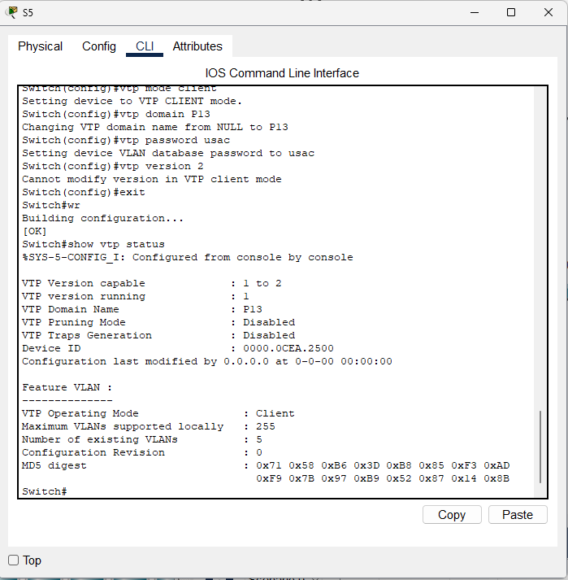

# Manual Técnico - Práctica 1 REDES

## Objetivos
- **Demostrar el conocimiento adquirido** sobre la creación de VLANS y el protocolo VTP, lo que permitirá la segmentación lógica de la red para mejorar el rendimiento y la seguridad.
- **Demostrar el conocimiento adquirido** sobre el Spanning Tree Protocol, que garantiza la redundancia y previene los bucles en la red.
- **Desarrollar una topología de red** en Packet Tracer según las especificaciones dadas.
- **Capturar paquetes** utilizando el modo simulación de Packet Tracer.

---

## Resumen de direcciones IP y VLAN

Terminaciones de carnet: 9 y 3. La suma 9+3 = 12 y se usara el ultimo digito **2**

| Departamento | VLAN ID | Red           |
|--------------|---------|---------------|
| Contabilidad | 22      | 192.168.22.0/24 |
| Secretaría   | 32      | 192.168.32.0/24 |
| RRHH         | 42      | 192.168.42.0/24 |
| IT           | 52      | 192.168.52.0/24 |

---


## 2. Capturas de la implementación de las topologías

### Centro Administrativo


### Backbone


### Área de trabajo


### Vista Completa


## 3. Detalle de los comandos usados

### Configuración de Switch como Servidor (SW1)

``` 
enable
configure terminal
vtp mode server
vtp domain P13 
vtp password usac
vtp version 2
exit
wr 
show vtp status  
```


### Configuración de los demás Switch como Cliente

``` 
enable
configure terminal
vtp mode client
vtp domain P13 
vtp password usac
vtp version 2
exit
wr
show vtp status
```


### Configuración de un Switch como Transparente (SW9)

``` 
enable
configure terminal
vtp mode transparent
vtp version 2
exit
wr
show vtp status
```




### Configuración de Modo Troncal entre Switches 2960

``` 
enable 
configure terminal
interface range f0/1-7
switchport mode trunk
switchport trunk allowed vlan all
exit 
exit 
wr
show run //para verificar si se configuró el modo troncal
```


### Configuración de Modo Troncal entre Switches 3560

``` 
enable 
configure terminal
interface range f0/1-7
switchport trunk encapsulation dot1q
switchport mode trunk
switchport trunk allowed vlan all
exit 
exit 
wr
show run //para verificar si se configuró el modo troncal
```


### Configuración de las VLANS desde el servidor

``` 
enable
configure terminal
vlan 22
name Contabilidad
exit
vlan 32
name Secretaria
exit
vlan 42
name RRHH
exit
vlan 52
name IT
exit
exit
show vlan //mostrar los vlans
```


### Configuración de los Switch a todas las PC los VLANS en los f0/#

- **Área: Contabilidad**  
``` 
enable 
configure terminal
interface f0/13
switchport mode access
switchport access vlan 22
no shutdown
exit
exit
wr
exit
```

- **Área: Secretaria**  
``` 
enable 
configure terminal
interface f0/11
switchport mode access
switchport access vlan 32
no shutdown
exit
exit
wr
exit
```

- **Área: RRHH**  
``` 
enable 
configure terminal
interface range f0/12-13
switchport mode access
switchport access vlan 42
no shutdown
exit
exit
wr
exit
```

- **Área: IT**  
``` 
enable 
configure terminal
interface f0/12
switchport mode access
switchport access vlan 52
no shutdown
exit
exit
wr
exit
```
``` 
interface gi1/0/3
interface range gi1/0/3-4
```


### Configuración de RSTP PVST al ROOT (SW1)

``` 
enable
configure terminal
spanning-tree mode rapid-pvst
spanning-tree vlan 1 root primary
exit
wr
show spanning-tree
```


### Configuración de RSTP PVST para los demás Switch

``` 
enable
configure terminal
spanning-tree mode rapid-pvst
exit
wr
show spanning-tree
```


## 4. Ping entre hosts

- **IP PC: IT**  


- **IP PC: RRHH**  


- **IP PC: CONTABILIDAD**  


- **IP PC: SECRETARIA**  


- Validar rstp (-t ping extendido)
``` 
ping -t 192.168.xx.xx
```

#### Área de RRHH

- **Ping dentro del área de RRHH**


- **Ping fuera del área de RRHH**


#### Área de Contabilidad

- **Ping dentro del área de Contabilidad**


- **Ping fuera del área de Contabilidad**


## Demostración de Funcionanmiento RSTP

<https://youtu.be/1B0nsWt_zoQ>

